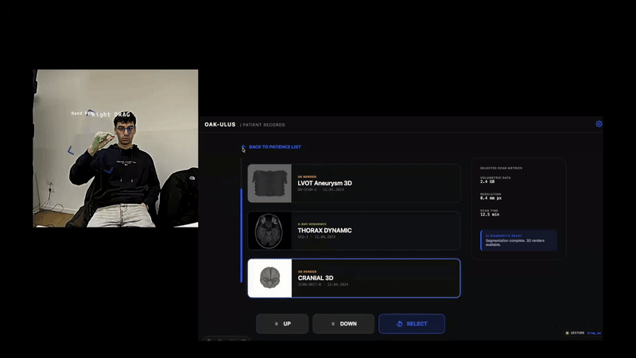
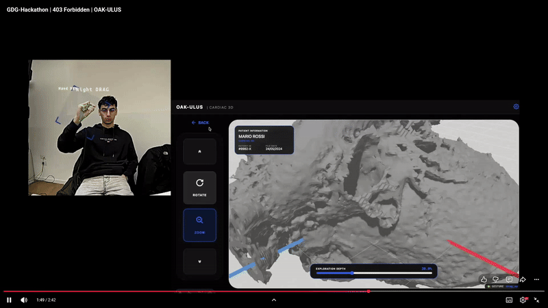
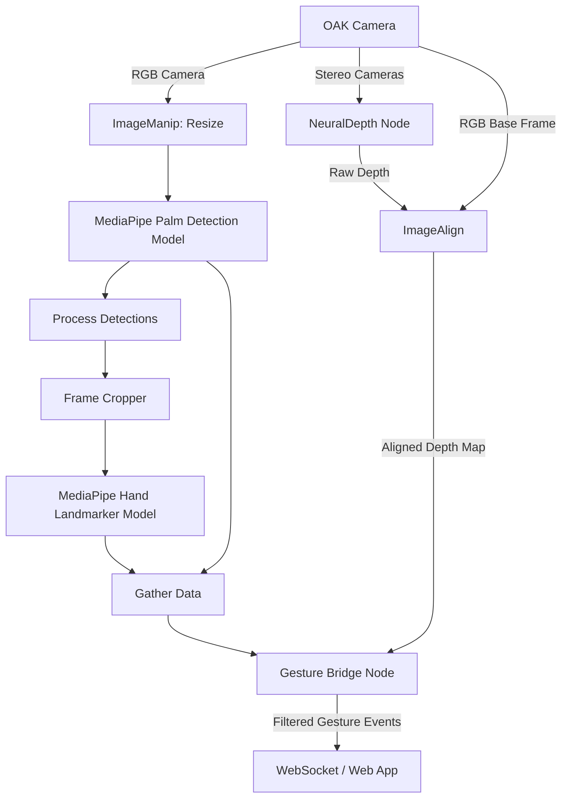

<div align="center">

<h1>Oak-Ulus: Gesture Control for Sterile Medical Environments</h1>

<p>
  <a href="https://www.linkedin.com/in/matteo-bergamaschi-158218390/">Matteo Bergamaschi</a>,
  <a href="https://www.linkedin.com/in/samuele-centanni">Samuele Centanni</a>,
  <a href="https://www.linkedin.com/in/francesco-della-casa/">Francesco Della Casa</a>,
  <a href="https://www.linkedin.com/in/lorenzo-di-maio/">Lorenzo Di Maio</a>
</p>

[](https://docs.google.com/presentation/d/1BrPsOA3b4s0JbKyzEE4lAzWzd_LS5EEXZl9sRsLKN4s/edit?usp=sharing)
[](https://youtu.be/VtZU0qFVRwk)

<br><br>

<a href="https://hilti-trimble-challenge.com/">
  
</a>

<hr>

## Demos

<p align="center">
  
  
</p>

</div>

>[!IMPORTANT]
> ### Achievement
> Obtained an **honorable mention** from the jury, ranking 4th out of 12 teams.

## Aim of the Project
The objective of this project is to provide a touchless gesture control system for doctors operating in sterile environments. By moving their hands in front of an OAK (Luxonis) camera, doctors can interact with a web application to view X-rays and 3D medical representations. This architecture requires absolutely zero physical contact, ensuring maximum sterility.

## Architecture

### Hand Gesture Model (MediaPipe)
The gesture recognition relies on the MediaPipe Hand Landmarker available in the Luxonis Model Zoo, which operates natively on the DepthAI v3 pipeline. It detects 21 3D landmarks per hand. The processing is handled through a 2-stage pipeline:
1. **Palm Detection:** Identifies the presence and bounding box of the hand using the MediaPipe palm detection model.
2. **Hand Landmark Detection:** A dedicated cropped frame of the detected hand is then passed to the pose estimation model to extract the precise structural landmarks.
<!-- @import "[TOC]" {cmd="toc" depthFrom=1 depthTo=6 orderedList=false} -->

<!-- code_chunk_output -->

- [Demos](#demos)
  - [Achievement](#achievement)
- [Aim of the Project](#aim-of-the-project)
- [Architecture](#architecture)
  - [Hand Gesture Model (MediaPipe)](#hand-gesture-model-mediapipe)
  - [Depth Model](#depth-model)
- [Chain Loop (Flow of the Model)](#chain-loop-flow-of-the-model)
- [Setup](#setup)
- [Running the Project](#running-the-project)
  - [Terminal 1: Hand Gesture Model (Backend):](#terminal-1-hand-gesture-model-backend)
  - [Terminal 2: Web Application (Frontend)](#terminal-2-web-application-frontend)

<!-- /code_chunk_output -->


### Depth Model
A NeuralDepth model processes inputs from the stereo cameras (CAM_B and CAM_C) to calculate spatial distance. The generated depth map is aligned with the primary RGB frame using an ImageAlign node. This spatial data acts as a strict depth filter: only hands detected within a specific physical distance (between 500 mm and 1000 mm) are processed into gestures. Hands outside this range, such as those belonging to people standing in front of or behind the primary user, are safely discarded before triggering the state-machine.

## Chain Loop (Flow of the Model)



## Setup
To configure the environment for the Python bridge layer:

1. Create a virtual enviroment
```bash
python3 -m venv .venv
```
2. Activate the pre-configured virtual environment located in the project root:
```bash
source .venv/bin/activate
```
3. Install the necessary dependencies/packages:
```bash
pip install -r requirements.txt
```

## Running the Project
To run the complete system, you must start both the gesture detection backend and the web application using two separate terminal instances.

### Terminal 1: Hand Gesture Model (Backend):
Ensure you have activated the virtual environment and your OAK camera is connected.

```bash
# Activate the virtual environment from the root directory
source .venv/bin/activate

# Navigate into the backend directory
cd hand-pose

# Run the peripheral host mode
python3 main.py
```

### Terminal 2: Web Application (Frontend)
The web application is built using Astro. You need to start the development server.

```bash
# Navigate to the frontend directory
cd oak-ulus

# Build the Docker image
docker build -t oak-ulus-webapp .

# Run the Docker container (mapping to standard Astro port 4321)
docker run -p 4321:4321 oak-ulus-webapp
```